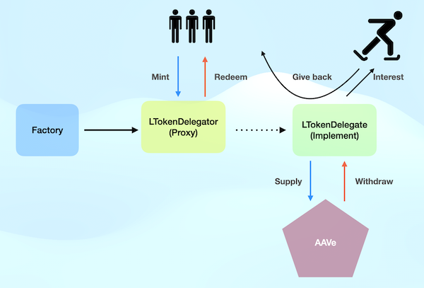

Sponsor Protocol
=================

# Description

Many potential people or projects are not easy to raise funds in the early stage. Without financial assistance, it is relatively difficult for these people in a certain field to develop. This contract is mainly to provide people with  `guaranteed capital` to sponsor these people, and to earn interest income by providing liquidity on the lending platform AAVE, which will be used to sponsor them.

The sponsor can get back the ETH at any time, and the sponsored person can give back to the previous or current sponsor. The proportion of the reward is based on amount * timestamp. The more the sponsorship amount and the longer the time, the more reward you will get.

# Framework


  -   Factory
      - Deploy and create a new sponsorship project contract, anyone can put it on the shelf, you need to provide some information of the sponsored person (address, url...),
     The added projects can be queried and managed in this contract, which is convenient for front-end connection.
-   LToken Proxy / LToken Implementation
    - Engagement contracts for sponsors, available here Mint / Redeem,
     Responsible for investing and redeeming the funds, and transferring the proceeds to the sponsored person.




# Development


-   Envirnment Variable
    -   Fillout .env.example file, and change file name to .env

-   Deploy Locally
    -   Start  `anvil`  Ethereum Node
    -   Deploy contracts on Anvil (locally)
    - Check "./frontend/constants.js" file, factoryAddress is the factory's address on Anvil
    - Open "./frontand/index.html with Live Server, interact with browser install Metamask
    - Add anvil local testnet to Metamask

```sh
anvil
```

```sh
make deploy-anvil
```

-   Deploy to Sepolia Testnet

```sh
make deploy-sepolia
```

# Testing

```sh
forge test -vvv
```


# Usage

Contracts have deployed to Sepolia testnet, and FE deployed to Github Page,
https://moment101.github.io/sponsorPage/index.html